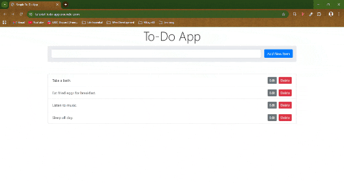

# Todo App

> This is a tutorial application from Brad Schiff. This is an application that will let you list down all your tasks.

## 📝 Documentations

- [Read Me](/README.md)
- [Development Log](/docs/dev-log.md)
- [Learning Notes](/docs/learning-notes.md)

## 🌏 Live Application

[https://tutorial-todo-app.onrender.com](https://tutorial-todo-app.onrender.com)

## 📦 Source Code

[https://github.com/chesteralejandro/tutorial-todo-app.git](https://github.com/chesteralejandro/tutorial-todo-app.git)

## 🏅 Purpose

This project was built to practice:

- Setting up MongoDB Atlas and how to use it.
- Writing documentations for the project using Markdowns.
- Learning good file structure.
- Writing good Git commit messages using Conventional Commits.

## ✨ Features

- Full CRUD Functionality: Create, view, update, and delete tasks with instant database synchronization.
- Database Integration: Permanent storage of data in the cloud using MongoDB Atlas.

## 🛠️ Tech Stack

- **Language:** JavaScript
- **Database:** MongoDB Atlas
- **Backend:** Node.js / Express
- **Frontend:** HTML5 / Bootstrap
- **Deployment:** Render

## ⚙️ Setup & Installation

After successfully cloning the repo:

1. Install dependencies: `npm install`
2. Create a `.env` file in the root folder. Add all necessary values.
3. Run the app for development: `npm run dev`

## 📸 Screenshot

